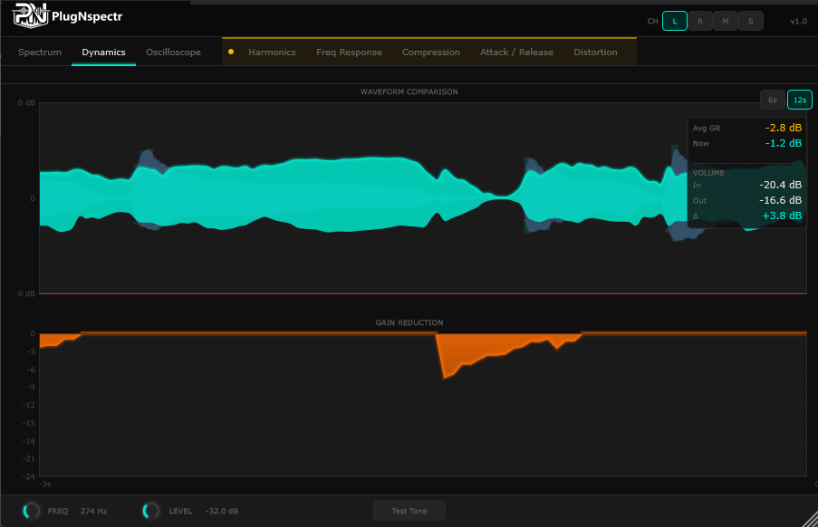
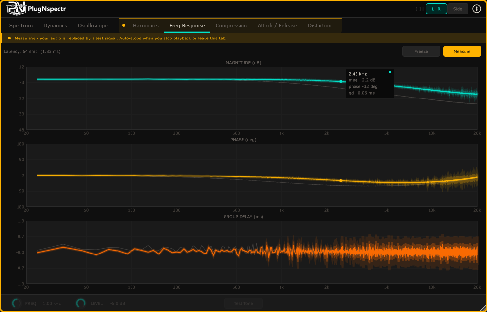
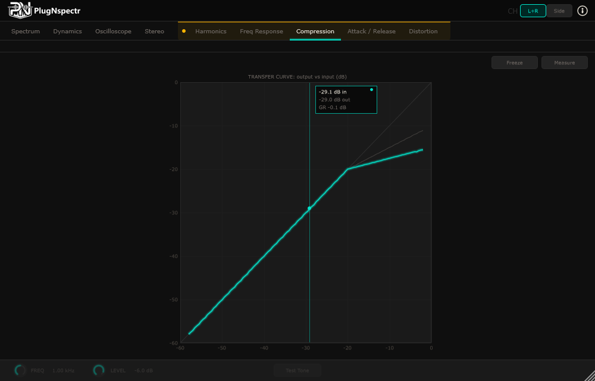
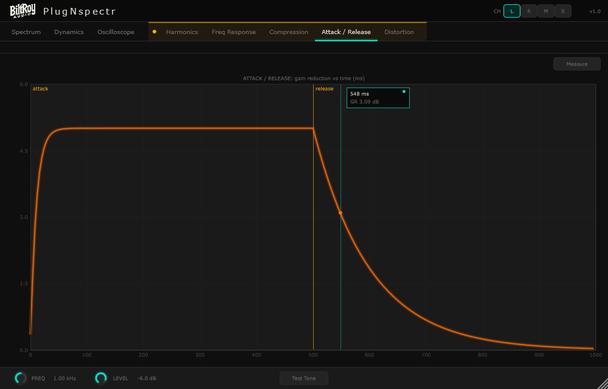
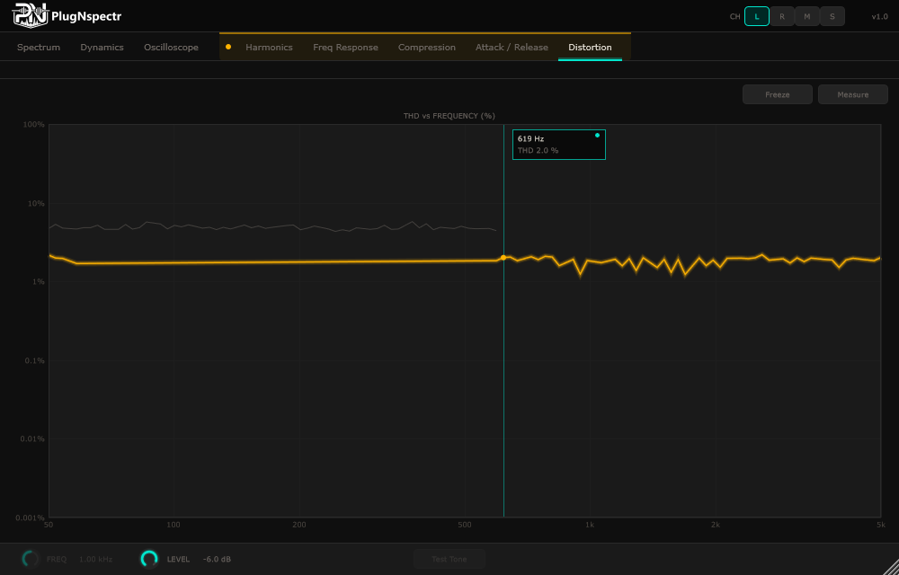

# PlugNspectr
### by Biltroy Audio

> A two-plugin VST3 signal-chain analyzer for Windows and any DAW that supports VST3.
> Insert Pre and Post around any plugin — or a whole chain — to see exactly what it's doing to your audio.



---

## Table of Contents

- [Overview](#overview)
- [Requirements](#requirements)
- [Installation](#installation)
- [How It Works](#how-it-works)
- [Setting Up the Signal Chain](#setting-up-the-signal-chain)
- [The UI at a Glance](#the-ui-at-a-glance)
  - [Analysis Channel — L / R / Mid / Side](#analysis-channel--l--r--mid--side)
  - [Measurement Safety](#measurement-safety)
  - [Cursor Readouts & Curve Freeze](#cursor-readouts--curve-freeze)
- [Live Analysis Tabs](#live-analysis-tabs)
  - [Spectrum](#spectrum-tab)
  - [Dynamics](#dynamics-tab)
  - [Oscilloscope](#oscilloscope-tab)
- [Measurement Tabs](#measurement-tabs)
  - [Harmonics](#harmonics-tab)
  - [Freq Response](#freq-response-tab)
  - [Compression](#compression-tab)
  - [Attack / Release](#attack--release-tab)
  - [Distortion](#distortion-tab)
- [Bottom Bar Controls](#bottom-bar-controls)
- [Tips and Best Practices](#tips-and-best-practices)
- [Building from Source](#building-from-source)
- [Architecture](#architecture)
- [Roadmap](#roadmap)

---

## Overview

PlugNspectr is a **before/after signal analyzer** that reveals exactly how any plugin — or any span of your chain — is affecting your audio. Unlike standalone analyzers, it works directly inside your DAW in real time: no test exports, no switching windows.

It consists of two companion VST3 plugins:

| Plugin | Role |
|---|---|
| **PlugNspectr Pre** | Insert before the plugin(s) you want to analyze. Captures the unprocessed reference signal and generates test stimuli on request. |
| **PlugNspectr Post** | Insert after. Hosts the analysis UI and compares the reference (Pre) signal against the processed (Post) signal. |

Both communicate via Windows shared memory, passing audio between them in real time with minimal latency impact.

Two complementary kinds of analysis:

- **Live analysis** — driven by your actual program material as it plays (Spectrum, Dynamics, Oscilloscope).
- **Measurement** — Post commands Pre to inject a controlled stimulus (sine, noise, level ramp/step, swept tone) and measures the plugin's exact response: frequency/phase, compression transfer, attack/release, and distortion. Because the stimulus runs through the *real* chain in your DAW, you measure the plugin exactly as it's configured in your session.

---

## Requirements

- **OS:** Windows 10 or later (64-bit)
- **DAW:** Any VST3-compatible host (developed and tested on Cubase 15 Pro)
- **Format:** VST3 (64-bit only)
- **Sample Rates:** 44.1 kHz, 48 kHz, 88.2 kHz, 96 kHz
- **Window:** Resizable, with sensible minimum/maximum bounds

---

## Installation

1. Copy both `.vst3` folders to your VST3 plugin directory:
```
C:\Program Files\Common Files\VST3\
```

Your directory should contain:
```
VST3\
  PlugNspectrPre.vst3\Contents\x86_64-win\PlugNspectrPre.dll
  PlugNspectrPost.vst3\Contents\x86_64-win\PlugNspectrPost.dll
```

2. Open your DAW and perform a full plugin rescan.

3. Both plugins will appear under **Biltroy Audio** in your plugin manager.

---

## How It Works

PlugNspectr uses **Windows Named Shared Memory** (`BiltroyPlugNspectrShared`) to pass audio between the Pre and Post plugins in real time, plus a small command channel (`BiltroyPlugNspectrCmd`) so Post can ask Pre to generate test stimuli.

- **PlugNspectrPre** captures each audio block in its `processBlock()` and writes it to shared memory with a heartbeat timestamp. When a measurement is armed, Pre replaces the signal with the requested stimulus so it passes through the plugin under analysis.
- **PlugNspectrPost** reads the Pre signal each block alongside its own input (the processed signal), and performs all FFT analysis, dynamics measurement, and visualization using both.
- If no Pre heartbeat is detected within 500 ms, Post shows a setup-guidance overlay.

> **Important:** Both plugins must be on the **same audio track or bus** — they cannot communicate across different tracks.

---

## Setting Up the Signal Chain

The correct insert order is:

```
Audio Signal
     ↓
[ PlugNspectr Pre ]        ← Insert here first
     ↓
[ Plugin Under Analysis ]  ← The plugin (or chain) you want to inspect
     ↓
[ PlugNspectr Post ]       ← Insert here last
     ↓
Audio Output
```

### Step by Step in Cubase

1. Open the **Insert FX** chain for your track or bus
2. Add **PlugNspectr Pre** as insert slot 1
3. Add the **plugin you want to analyze** as insert slot 2 (or several plugins — Pre/Post can wrap a whole span)
4. Add **PlugNspectr Post** as insert slot 3
5. Open **PlugNspectr Post** — the UI activates automatically when audio plays


> **Tip:** PlugNspectr works on any track type — audio tracks, instrument tracks, group buses, and the master bus.

### Adding Both Plugins at Once (FX Chain Preset)

A plugin can't insert its companion automatically — the DAW controls the insert chain. To add Pre and Post together in one step, save them as a **Cubase FX Chain Preset**:

1. Set up the chain once — **Pre** → plugin under analysis → **Post**
2. In the **Inserts** rack header, open the preset menu and choose **Save FX Chain Preset…**
3. Name it, e.g. `PlugNspectr Pre+Post`
4. On any future track, load that preset to drop both inserts at once

> **Tip:** Save a version with only **Pre → Post** (no middle plugin) — loading it gives you the empty analyzer pair, ready for you to drop a plugin into the slot between them.

---

## The UI at a Glance

PlugNspectr Post has **eight tabs**, grouped by how they get their signal:

- **Live analysis** (program material): **Spectrum · Dynamics · Oscilloscope**
- **Measurement** (inject a test signal): **Harmonics · Freq Response · Compression · Attack / Release · Distortion**

The measurement tabs sit on a recessed **amber tray** in the tab bar to set them apart — they're the ones that temporarily replace your audio with a test signal.

### Analysis Channel — L / R / Mid / Side

The header has an **L R M S** selector that chooses which channel *all* analysis runs on:

| Mode | Signal |
|---|---|
| **L** | Left |
| **R** | Right |
| **M** | Mid — (L + R) / 2 |
| **S** | Side — (L − R) / 2 |

This is **analysis-only** — your audio always passes through untouched in full stereo. Mid/Side is ideal for checking what a plugin does to the center (vocals, kick, bass) versus the stereo sides independently.

### Measurement Safety

The measurement tabs replace your audio with a test signal — dangerous on a master bus. PlugNspectr makes this impossible to miss:

- An **amber border** frames the whole window and an **amber banner** appears below the tab bar whenever any stimulus is active.
- The **Measure** / **Test Tone** buttons turn solid amber while armed.
- The stimulus **auto-stops** when you **leave the tab** or **stop DAW playback** — so a tone can't keep blasting after you stop the transport.

Throughout, the color language is consistent: **teal = your current selection**, **amber = test signal touching your audio**.

### Cursor Readouts & Curve Freeze

- **Cursor readout:** hover any measurement plot for a hairline, a dot on the curve, and a value chip reading the exact value at that point (frequency + magnitude/phase/group-delay, input→output level, time→gain-reduction, or frequency→THD%). **Click to lock** it; click again or move off to release.
- **Freeze (A/B):** the Freq Response, Compression, and Distortion tabs have a **Freeze** button that snapshots the current curve as a dimmed reference overlaid under the live measurement — drop-in plugin A, freeze, swap to plugin B, and compare directly.

---

## Live Analysis Tabs

### Spectrum Tab

> _Screenshot pending refresh._

Real-time FFT frequency analysis showing how the plugin is shaping your audio's frequency content.

**What you see:**
- **Pre signal** (lavender, dimmed) — the unprocessed spectrum
- **Post signal** (bright teal, glowing) — the processed spectrum
- **Pre / Post Averages** — 10-second rolling averages, with an amber fill between them showing the cumulative EQ difference

**Controls (top right):** smoothing speed (**Fast / Medium / Slow**) and an **Avg** toggle for the average lines.

**Interactive inspection:** hover for a hairline + tooltip (frequency, Pre dB, Post dB); click to lock, click again to unlock.

**Frequency Variance Markers:** after ~3 seconds, up to **5 floating markers** highlight where the Pre and Post *average* curves diverge most — i.e. where the plugin is making its biggest EQ changes over time. Clustered markers indicate a broad shelf/resonance; a `↑` boost marker indicates a frequency synthesized or heavily boosted from near-silence. Markers are based on the rolling 10-second averages, so let audio run 10+ seconds for accurate positions.

**Axis:** X = 20 Hz–20 kHz (log), Y = −90 dB to +12 dB.

---

### Dynamics Tab


Reveals how the plugin is affecting dynamic range and level in real time.

**Waveform comparison (top):** Pre (soft sand, background) vs Post (bright teal, foreground) overlaid; where Post is smaller than Pre, compression/limiting is occurring, highlighted by the teal fill. Time window: **6s** or **12s** (default).

**Readouts (right panel):**
| Readout | Description |
|---|---|
| **Avg GR** | Average gain reduction over the last 30 s (amber) |
| **Now** | Instantaneous gain reduction — holds last non-zero value (teal) |
| **In / Out** | RMS input / output level (dB) |
| **Δ** | Net level difference (orange = attenuation, teal = gain, grey = unity) |

> **Double-click** the Avg GR or Now label/value to reset the readings.

**Gain Reduction (bottom):** a scrolling GR history with an orange gradient fill and a peak-hold line. Y = 0 to −24 dB; X = last 3 seconds. Flat at 0 = dynamically transparent; deep consistent dips = heavy compression; brief dips = peak limiting.

---

### Oscilloscope Tab

> _Screenshot pending refresh._

A zero-crossing-triggered oscilloscope of both signals — useful for phase shifts, transient shaping, clipping, and saturation character.

- **Pre** (lavender, receding) vs **Post** (bright teal) overlaid; triggering locks to a rising zero-crossing in the Post signal (auto-trigger style, non-swimming).
- Time windows: **10ms** (individual cycles / transients), **50ms** (default, attack/release), **100ms** (slower events).
- Look for: lines overlaid = transparent; smaller Post = gain reduction; shifted Post = latency/phase; different shape = harmonic coloration; flat tops = clipping.

---

## Measurement Tabs

> All measurement tabs inject a test signal through the plugin under analysis. The amber border/banner and auto-stop ([Measurement Safety](#measurement-safety)) are active whenever they're running.

### Harmonics Tab

> _Screenshot pending refresh._

Harmonic-distortion analysis using a pure sine test tone. Identifies the character and intensity of even and odd harmonics H2–H8.

- **FREQ** (footer) sets the tone frequency; **LEVEL** (footer) sets its level; **Test Tone** arms it.
- **Pre** spectrum shows the clean fundamental; **Post** shows the plugin's output — any added frequencies are harmonics. Vertical markers sit at H1–H8 with colored diamonds at each peak.
- **Readouts:** THD Pre %, THD Post %, and individual H2–H8 levels (Pre/Post). Values below −60 dB show as `---`.
- **Even harmonics** (H2/H4/H6/H8) → warm, tube/tape character; **odd** (H3/H5/H7) → harsher, transistor/digital character. THD Post near 0% = clean; 1–5% = subtle coloration; >10% = significant saturation.

---

### Freq Response Tab



The full **linear transfer function** of the plugin, measured with a white-noise stimulus (cross-spectrum H1 = Pre→Post). Three stacked plots:

- **Magnitude (dB)** — the exact frequency response (boosts/cuts), beyond what the live Spectrum averaging can show.
- **Phase (deg)** — phase response, with bulk latency de-rotated out.
- **Group Delay (ms)** — frequency-dependent delay.

A **Latency** readout reports the measured Pre→Post delay in samples / ms. Hover for the cursor readout (frequency + magnitude/phase/group-delay at the hairline); **Freeze** to A/B against another plugin or setting.

---

### Compression Tab



The **static transfer curve** (output level vs input level), measured by Pre sweeping a tone's level from −60 to 0 dBFS while Post bins output against input. Reveals threshold, ratio, and knee at a glance:

- A straight 1:1 diagonal = no compression; a bend = the knee; a shallower slope above it = the ratio; downward expansion/gating shows as a steeper region below the knee.
- Cursor readout shows **input → output + gain reduction** at the hairline. **Freeze** for A/B comparison.

---

### Attack / Release Tab



The measured **time response** — gain reduction vs time — captured with a level-step stimulus (Pre alternates a loud/quiet 1-second cycle) and synchronously averaged. The curve shows the **attack** ramp when the level jumps up and the **release** decay when it drops, so you can read a compressor's real attack/release behavior. Cursor readout shows **time → gain reduction** at the hairline.

---

### Distortion Tab



**THD vs frequency** — total harmonic distortion measured as Pre sweeps a stepped tone across the spectrum (50 Hz → 5 kHz, log). Shows how a plugin's distortion changes with frequency (e.g. more harmonic generation in the lows from tape/tube emulations), plotted log-log. Cursor readout shows **frequency → THD %**; **Freeze** for A/B comparison.

---

## Bottom Bar Controls

The footer hosts the test-tone controls and global level trim:

| Control | Function |
|---|---|
| **FREQ** | Test-tone frequency (100 Hz – 8000 Hz, default 1000 Hz) |
| **LEVEL** | Test-tone level (dBFS) |
| **Test Tone** | Arms / disarms the sine test tone (turns amber while active) |
| **IN trim** | −24…+24 dB — scales the Pre signal for analysis only (does not affect audio) |
| **OUT trim** | −24…+24 dB — scales the actual Post audio output |

> **Double-click** a trim slider to reset to 0.0 dB. Trims display grey at 0 dB and teal when active.

---

## Tips and Best Practices

### General
- Insert Pre **before** the plugin and Post **after** — order matters; both on the **same track/bus**.
- **Live** tabs need audio playing. **Measurement** tabs generate their own stimulus, but the transport must be running (audio has to flow through the chain) — and they auto-stop when you leave the tab or stop playback.
- Use the **L/R/M/S** selector to check the center vs the stereo sides independently.
- Save the Pre/Post pair as an **FX Chain Preset** to add both inserts at once.

### Live tabs
- **Spectrum:** use **Slow** smoothing for subtle EQ coloration; let audio run 10+ seconds before reading the averages and variance markers.
- **Dynamics:** the **30-second Avg GR** is the most musically meaningful compression reading; use **12s** for compressors and **6s** for limiters; the **Δ** readout flags non-unity gain.
- **Oscilloscope:** **10ms** for individual transients, **50ms** for compressor attack/release, **100ms** for longer passages.

### Measurement tabs
- **Freq Response** is the most accurate way to see a plugin's exact EQ and phase — far more precise than live spectrum averaging.
- Use **Freeze** to A/B two plugins (or two settings) on Freq Response, Compression, and Distortion.
- **Harmonics:** start with the default 1 kHz tone for comparable readings; lower the frequency to inspect higher harmonics on plugins that generate many overtones.

---

## Building from Source

### Prerequisites
- [JUCE](https://juce.com) 8.x
- Visual Studio 2022/2026 with the C++ Desktop Development workload
- Windows 10/11 SDK

### Plugins (VST3)

1. Clone the repo, then open each `.jucer` in **Projucer** and click **Save Project** once (this generates `JuceLibraryCode/` and `BinaryData`, which are git-ignored):
   - `PlugNspectrPre/PlugNspectrPre.jucer`
   - `PlugNspectrPost/PlugNspectrPost.jucer`
2. Open each generated `.sln` in Visual Studio:
   - `PlugNspectrPre/Builds/VisualStudio2026/PlugNspectrPre.sln`
   - `PlugNspectrPost/Builds/VisualStudio2026/PlugNspectrPost.sln`
3. Build **Release | x64**, then copy the `.vst3` folders to `C:\Program Files\Common Files\VST3\`.

### Development tooling (CMake)

`tools/render-harness/` builds, via CMake against your JUCE install, two extra targets that never touch the Projucer projects:

- **`RenderHarness`** — a headless console app that drives the real Post editor with synthetic audio and dumps PNG frames (used to generate this README's screenshots and to eyeball UI changes without a DAW). Needs the plugin's `BinaryData` generated once first.
- **`PnsPostStandalone`** — the full Post UI as a launchable `.exe` with its own audio device, for instant manual iteration.

```bash
cmake -S tools/render-harness -B tools/render-harness/build -DJUCE_DIR="C:/Program Files/JUCE"
cmake --build tools/render-harness/build --config Release --target RenderHarness
```

### Tests

`tools/tests/` holds [doctest](https://github.com/doctest/doctest) unit suites that validate the measurement DSP against closed-form references — **editor-free**, so they build straight from the processor sources with no Projucer/BinaryData needed:

```powershell
powershell -File tools/tests/run-tests.ps1
```

A tracked **pre-push hook** runs the suites before every push; enable it once per clone with `powershell -File tools/tests/install-hooks.ps1`. See [tools/tests/README.md](tools/tests/README.md) for details.

### Key technical details

| Detail | Value |
|---|---|
| Shared memory / command names | `BiltroyPlugNspectrShared` / `BiltroyPlugNspectrCmd` |
| Pre / Post VST3 IDs | `BNSP` / `BNSQ` (manufacturer `Bilt`) |
| Spectrum FFT | 2048-point, Hann window (order 11) |
| Measurement FFT | 4096-point (magnitude / phase / group-delay, THD) |
| Latency measurement | PHAT cross-correlation of the Pre→Post impulse |
| Spectrum smoothing | Exponential moving average (0.6 / 0.85 / 0.95) |
| Target frame rate | 60 fps |
| Heartbeat timeout | 500 ms |

---

## Architecture

```
┌──────────────────────── DAW Audio Thread ────────────────────────┐
│                                                                   │
│  ┌──────────────┐    ┌──────────────┐                             │
│  │PlugNspectrPre│───▶│ Your Plugin  │───▶ (to) PlugNspectrPost    │
│  │processBlock()│    │processBlock()│                             │
│  └──────┬───────┘    └──────────────┘         ┌──────────────┐    │
│         │ write Pre signal / read commands     │PlugNspectrPost│   │
│         ▼                                       │processBlock() │   │
│  ┌──────────────────────────┐  shared mem      └──────┬────────┘   │
│  │ Windows Named Shared Mem  │─────────────────────────┘            │
│  │ BiltroyPlugNspectrShared  │◀── Cmd: BiltroyPlugNspectrCmd        │
│  └──────────────────────────┘         (Post → Pre: stimulus)       │
└───────────────────────────────────────────────┬───────────────────┘
                                                 │ UI thread (60 fps)
                                          ┌──────▼────────────────┐
                                          │   PluginEditor         │
                                          │  Live: Spectrum,       │
                                          │        Dynamics, Scope │
                                          │  Measure: Harmonics,   │
                                          │   Freq Response,       │
                                          │   Compression,         │
                                          │   Attack/Release,      │
                                          │   Distortion           │
                                          └────────────────────────┘
```

---

## Roadmap

### Shipped
- Linear measurement — magnitude / phase / group delay + latency detection
- Static compression transfer curve
- Measured attack / release envelope
- THD-vs-frequency distortion sweep
- Curve **Freeze** (A/B) on Freq Response, Compression, Distortion
- **L / R / Mid / Side** analysis
- Measurement-safety system (amber border/banner, armed buttons, auto-stop on tab change or transport stop)
- Cursor readouts on all measurement plots
- Resizable window
- Headless render harness + standalone build + unit-test suites

### Planned
- IMD (two-tone intermodulation) and THD+N
- Selectable FFT size; optional oversampling / aliasing view
- Linear-vs-minimum-phase readout
- Stereo field comparison (Lissajous display)
- Performance tab — CPU and latency overview
- Mac / AU support

---

## License

PlugNspectr is free software: you can redistribute it and/or modify it under the terms of the **GNU General Public License v3.0** as published by the Free Software Foundation.

See [LICENSE](LICENSE) for the full license text.

© 2026 Biltroy Audio

---

*PlugNspectr is developed by Biltroy Audio using JUCE and C++.*
*Built with ❤️ for mixing / mastering engineers and producers who want to measure and see what their plugins are actually doing.*
